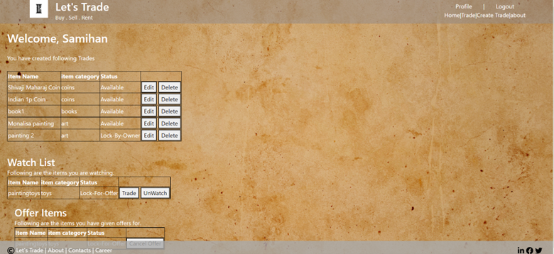
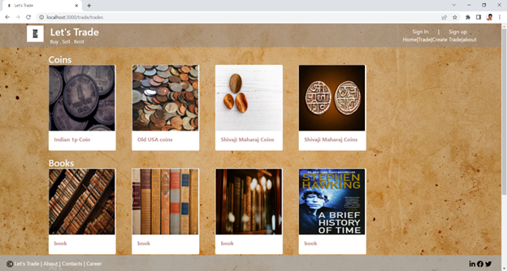
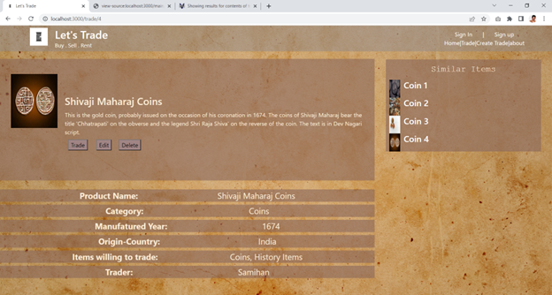
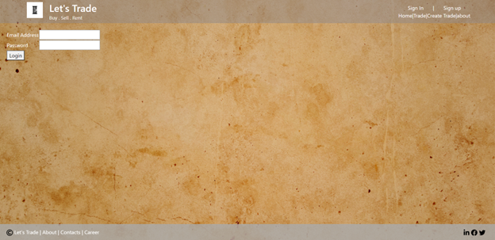
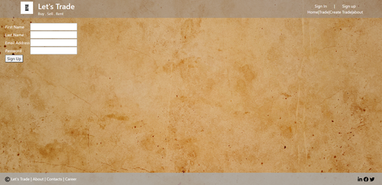
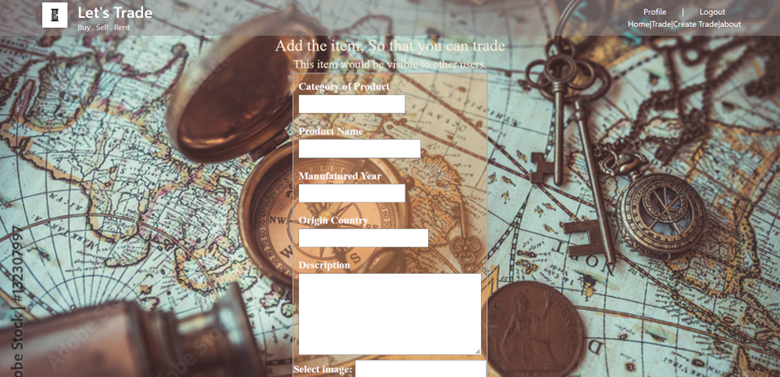

<h1 align="center">
  
  <h1 align="center">Lets Trade</h1>
</h1>


In this project, I have developed a web application called ‘Let’s Trade’. This application would act as a middleware for users to trade any antique or collectible items with other users.User can keep a watch on trade. When user select to watch the trade, that trade is been added in watch list of the user.
User would be able to trade the item with other user.When user click trade, he/she would be asked to select the item from his trade items for the trade. When item is been traded and then the user deletes traded item, that trade is been deleted from watchlist and trade list.

item and user json files are provided, you can integrate/upload that in your mongoDB database.

You view the screenShots of WebApp in ./media folder

Demo

https://user-images.githubusercontent.com/22686539/168919409-9389d86c-b31c-49c8-bf88-0ecc27b3b94e.mp4

Below are few ScreenShots of the Webapp:

<br>
Trade Page
<br>
All Trade
<br>

<br>

<br>
Sign In page:
<br>

<br>
Sign Up Page:
<br>

<br>
Create Trade
<br>

<br>

## Tech/framework used

<b>Built with</b>
- [NodeJS](https://nodejs.dev/)
- [ExpressJs](https://expressjs.com/)
- [MongoDB](https://www.mongodb.com/)

## Features
- Used MVC architecture to structure a web application
- Develop an end-to-end web application using the MEN stack
- Use EJS template pages to present the view to the browser.
- Integrate MongoDB as database
- App reinforce the authorization rules and respond according to the role of the user. 
- use flash messages to alert user with success and error notifications.
- The server side input validation validates and sanitizes user inputs before they are stored in the database.


## How to use?
Steps to run the application:
```
npm install
npm start
```

## You can reach out 😊😊

Feel free to contact me about the problems. I will try to help as much as I can 

[](https://www.linkedin.com/in/samihan-jawalkar-b38457a1/)
[](mailto:samihan.jawalkar@gmail.com)
[](https://twitter.com/samihan162)
[](https://github.com/samihan123)


## Acknowledgments

- Getting Better at NodeJs and ExpressJs
- Learning new stuffs
